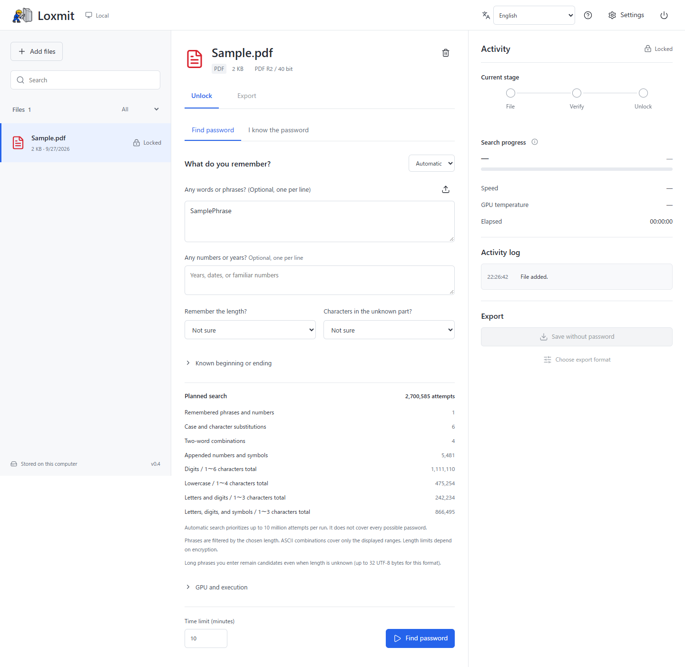

# Loxmit

English | [日本語](README.ja.md)

**Recover access to your own password-protected files. Keep the work local.**

Loxmit is an open-source desktop app for authorized password recovery and saving
unlocked copies of PDF, Office, and ZIP files. It uses Hashcat as its recovery
engine and opens its interface in your browser. Original files are not modified;
documents and passwords are not uploaded to a cloud service.

**Alpha software.** Recovery is not guaranteed. This is an independent project,
not an official Hashcat product or a replacement for its engine.

[Download desktop app](https://github.com/7011yamazakyuuta-star/Loxmit/releases) ·
[User guide](kaperio/README.md) · [Report a bug](https://github.com/7011yamazakyuuta-star/Loxmit/issues/new/choose) ·
[Security and privacy](SECURITY.md)

*Example with a generated test file. The app starts with an empty library.*

## Get Started

Download an archive from **Releases**, extract the entire folder, and launch
Loxmit. Desktop packages include Python; you do not need to install it separately.
Read the selected release's notes for its version and verification results.

| Platform | Archive suffix | Launch | Optional Hashcat setup |
| --- | --- | --- | --- |
| Windows x64 | `windows-amd64.zip` | `Loxmit.exe` | Download official package after consent |
| macOS 15+, Apple Silicon | `darwin-arm64.zip` | `Loxmit.app` | Extract bundled build after consent |
| macOS 15+, Intel | `darwin-x86_64.zip` | `Loxmit.app` | Extract bundled build after consent |
| Linux x86-64 | `linux-x86_64.tar.gz` | `Loxmit/Loxmit` | Extract bundled build after consent |

Linux builds target Ubuntu 22.04 / glibc 2.35 or newer. Other distributions and
GPU runtimes may require additional verification. GPU drivers are never installed
or updated by Loxmit. Packages are currently **unsigned and not notarized**;
do not disable OS security protections globally to run them. SHA-256 checksums
help detect corruption but do not replace publisher signatures.

1. Start with the empty library. The optional guide helps you check your GPU and
   install only the components you approve.
2. Add a file you own or have explicit permission to recover. Choose **Find
   password** and enter remembered clues, or **I know the password** to unlock
   directly. Known-password unlocking does not require Hashcat.
3. Copy the recovered password and **Save without password**, or choose an export
   format. Keep the original and review the exported copy.

The interface supports **English and Japanese**, with a saved language selector.
Browser language is used initially; other languages fall back to English.
Tool-generated diagnostic logs remain verbatim. Quit with the power button;
closing the browser tab alone does not stop the local process.

## Features and Limits

| Area | Available | Important limits |
| --- | --- | --- |
| File types | PDF, `.xlsx`, `.pptx`, `.docx`, ZIP | Recognized encryption formats only; [format matrix](kaperio/README.md#supported-files) |
| Recovery | Clue-first search, dictionaries, masks, rules, hybrid searches | ZIP recovery needs a separately configured `zip2john` |
| Long passwords | Long clues and length settings above 16 characters | Encryption-specific byte limits apply; exhaustive long searches are not practical |
| Export | Unlocked original format, image PDF, page-image Word, PNG ZIP, existing text | Depends on input; image Word is not editable OCR text |
| Controls | Pause/resume, time and temperature limits, optional workload tuning | Resume may repeat candidates after the last checkpoint |
| Diagnostics | GPU detection and an opt-in synthetic compute check | Detection, compute correctness, and speed are different tests |
| Input size | Up to 200 MiB per file | Processing can need much more RAM and disk space |

Office rendering requires a supported Office or LibreOffice installation.
There is no claim that Loxmit is universally faster than upstream Hashcat. See
[performance evidence and limits](kaperio/docs/PERFORMANCE.md).

## Privacy and Verification

Work copies, candidate lists, hashes, checkpoints, and unlocked exports remain on
your computer. These can be sensitive. **Loxmit does not encrypt its stored data.**
Recovered passwords are displayed from memory and disappear after app restart;
saved exports remain. Deleting a library entry is not secure erasure.

The app uses a token-protected loopback server by default. Document workers have
resource limits, but **not a full filesystem or network sandbox**. Treat unknown
documents with caution. Optional private-LAN HTTPS is experimental; there is no
standalone iOS or Android recovery app and no one-click remote setup.

[CI](https://github.com/7011yamazakyuuta-star/Loxmit/actions/workflows/desktop.yml)
builds and smoke-tests four native packages. A successful hosted build is not
evidence of physical GPU performance. Windows has local hardware test evidence;
macOS/Linux physical GPU coverage remains limited. Consult each release's notes,
[desktop verification](kaperio/docs/DESKTOP.md), and
[recovery diagnostics](kaperio/docs/RECOVERY_DIAGNOSTICS.md).

## Contribute

Bug reports, translations, and reproducible platform reports are welcome in
**English or Japanese**. Use synthetic sample files, never private documents,
passwords, hashes, or launch URLs. See [contribution guide](CONTRIBUTING.md).
Sensitive vulnerabilities belong in [private security reports](https://github.com/7011yamazakyuuta-star/Loxmit/security/advisories/new), not public issues.

For source setup, use Python 3.12+ and follow the [user/developer guide](kaperio/README.md#run-from-source).
The internal `kaperio/` directory and legacy launchers remain for compatibility;
the public product and repository name is **Loxmit**.

## License

[MIT](LICENSE) for Loxmit. External tools and bundled components retain their own
[licenses and notices](kaperio/THIRD_PARTY.md). The software license does not grant
permission to access someone else's files.
